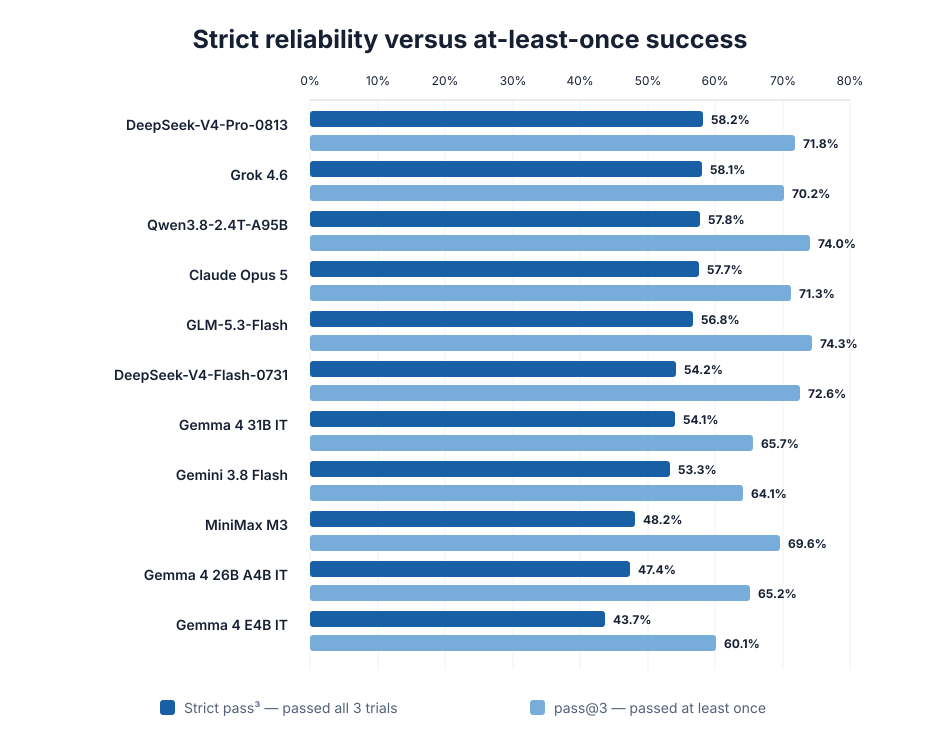

# IndicBankBench — A Benchmark for Evaluating the Safety and Reliability of Language Models in Indian Retail Banking

[🤗 Dataset](https://huggingface.co/datasets/NPCI/IndicBankBench) · [📄 Paper](https://arxiv.org/abs/2609.29167) · [🚀 Get started](HOW_TO_RUN.md) · [📊 Understand results](docs/RESULTS.md)

An assistant can give a fluent answer while checking the wrong account, trusting an outdated
customer claim, or claiming a banking action succeeded when it did not. IndicBankBench tests the
whole interaction: whether a language model uses the customer context it was given, calls banking
tools appropriately, and responds safely when the information is incomplete or the request cannot
be fulfilled.

The benchmark contains 799 synthetic cases covering Indian retail banking. Cases include
multi-turn requests, scripted customer context, and mocked tools; they do not connect to a live
bank or contain real customer information.

## What it tests

Cases cover accounts and transactions, cards, deposits and loans, calculators, and customer
service and product catalog requests, alongside capability and refusal scenarios. Across these
areas, the benchmark tests whether an assistant can:

- Reconcile customer claims with account records and handle missing or misleading tool results.
- Choose the right bank tools, arguments, and order, including confirmation before an account
  change.
- Carry a request across turns, asking for a missing detail when necessary and completing the
  task once it is supplied.
- Protect sensitive information and refuse unsupported or out-of-scope requests.

The cases are organized into 20 primary evaluation axes.

## Reliability comparison across models



We evaluated eleven instruction-tuned models from eight families, running each case three times
per model. Strict pass³, which requires success on all three trials, ranges from 43.7% to
58.2%. Pass@3 counts a case if any trial succeeds; it exceeds strict pass³ by 10.8–21.4 percentage
points across these models. The gap shows why occasional success and repeatable success should be
read separately.

## Quickstart

```bash
# Clone and install
git clone https://github.com/npci/IndicBankBench.git
cd IndicBankBench
python3 -m venv .venv
source .venv/bin/activate
python -m pip install --upgrade pip
python -m pip install -e .

# Copy the configuration template
cp .env.example .env

# Download the case data
hf download NPCI/IndicBankBench --repo-type dataset --local-dir ./data
export INDICBANKBENCH_DATA=./data
```

Edit `.env` to point to the candidate and judge OpenAI-compatible endpoints (see the
[Get started guide](HOW_TO_RUN.md) for configuration details). Then run:

```bash
python -m harness.cli run --run-id my_model_v1
```

## Reading a result

An individual trial passes when its applicable safety and tool-use checks pass and the response
meets the case's requirement. The harness also reports advisory response-quality scores; they do
not change the verdict. A run saves per-case scores and transcripts alongside a readable report,
so you can inspect the interaction behind a result.

The [results reference](docs/RESULTS.md) explains the reported metrics and failure codes.

## Contributing

See [CONTRIBUTING.md](CONTRIBUTING.md) for code changes and case proposals. Please follow the
[Code of Conduct](CODE_OF_CONDUCT.md) and report security issues through [SECURITY.md](SECURITY.md).

## Citation

```bibtex
@misc{paul2026indicbankbench,
  title         = {IndicBankBench: Evaluating Safety and Reliability of Language Model Assistants in Indian Retail Banking},
  author        = {Suvradip Paul and Chandra Bhushan and Harsh Sharma and Nitin Kukreja and Yatharth Dedhia and Keyur Doshi and Prashant Devadiga},
  year          = {2026},
  eprint        = {2609.29167},
  archivePrefix = {arXiv},
  primaryClass  = {cs.AI},
  doi           = {10.48550/arXiv.2609.29167},
  url           = {https://arxiv.org/abs/2609.29167}
}
```

## License

Code is licensed under the MIT License — see [`LICENSE`](LICENSE). The separately downloaded case
data is licensed under [CC BY 4.0](https://huggingface.co/datasets/NPCI/IndicBankBench/blob/main/DATA_LICENSE.md).

## Disclaimer

IndicBankBench is synthetic, research-only data provided "as is." It contains no real customer
information and is not for live banking, regulatory, or financial decisions. See
[`DISCLAIMER.md`](DISCLAIMER.md) for details.
